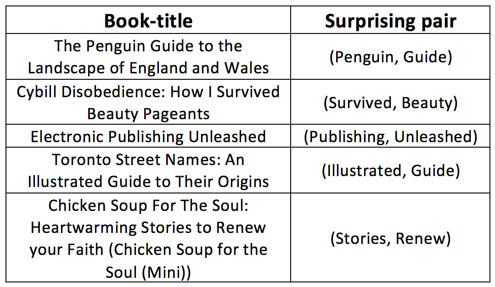
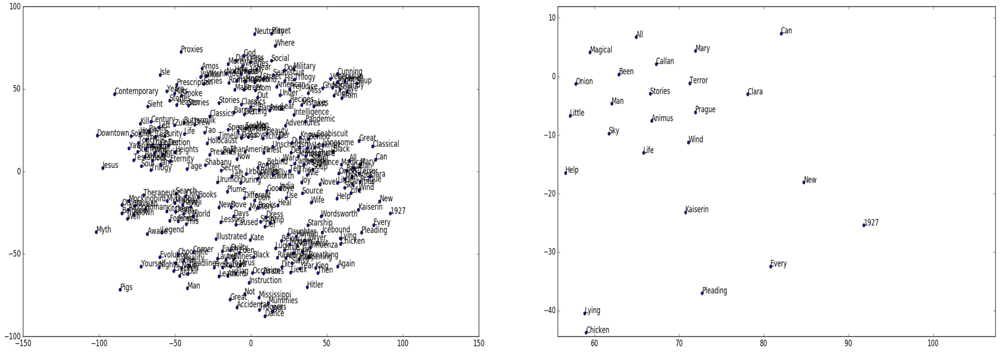
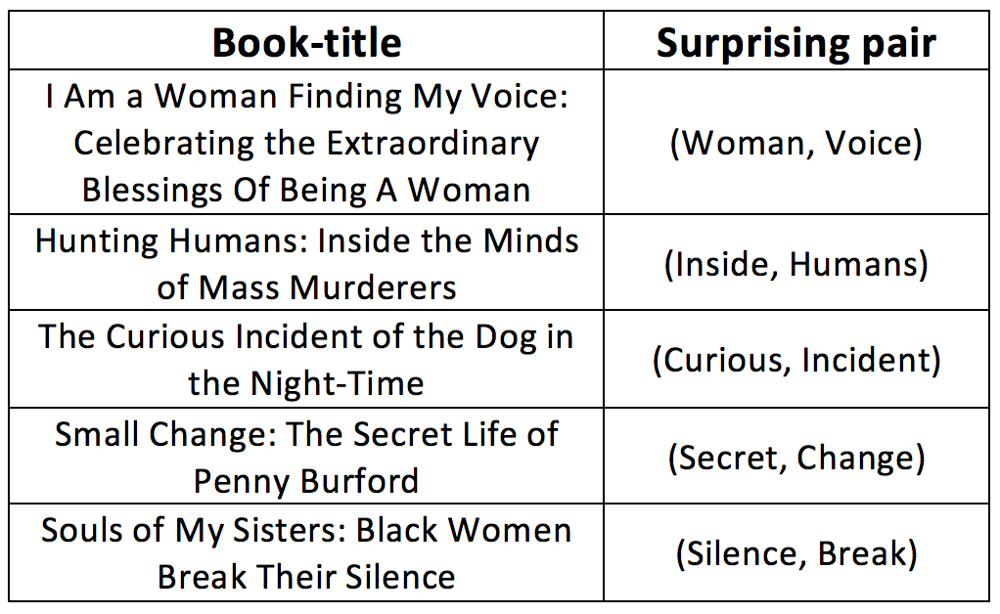

## Conceptual shifts model

This repository introduces two different computational models of surprise in the domain of books. Given the title of the book, the goal is to identify the most surprising pair that appears in the title using corpus-trained statistical language models.  

 

*Examples of conceptual shifts results.*

## Dataset

We use a public benchmark known as book crossing dataset that contains 271379 books. The dataset can be found in: http://www2.informatik.uni-freiburg.de/~cziegler/BX/

 The metadata has eight fields. For the purpose of this project we use only the two fields: ISBN and Book-Title.  

## Surprise based on features

We extract word2vec representation for each word in the book title using a pre-trained model. The model is trained on the Google News corpus with a vector size of 300. Download the model from: https://github.com/mmihaltz/word2vec-GoogleNews-vectors 

We group words into different clusters using a k-means algorithm. We compute the conditional probability of labeled pairs, that is, how likely the word labeled as cluster “a” is followed by another word labeled as cluster “b”. The two words with the lowest conditional probability are considered as surprising pairs.   

 

*Visualize word embedding for 500 word samples in 2D scatter plot using t-SNE.*

To see the results for adjucent pairs, use:

    python features_adj.py

To see the results for adjucent pairs, use:

    python features_non_adj.py

Table below shows the results for selected non-adjucent surprising pairs:

 

## Surprise based on bigrams

In this approach, we first remove the stop words from the content of each book title. Then each title is converted to a set of ordered pairs and surprise is calculated based on the lowest conditional probability in each title.  

To observe the surprise pairs based on bigrams for the first 100 titles, use:

    python bigrams.py

Table below shows the results for selected book-titles:

